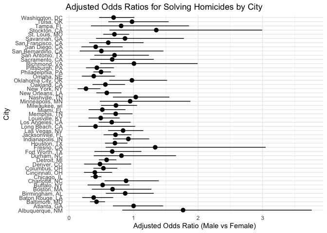
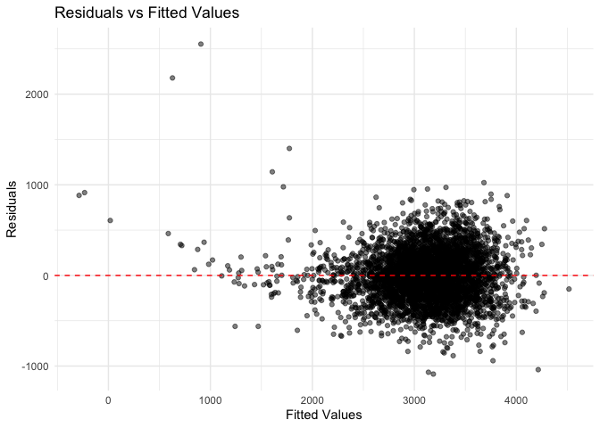
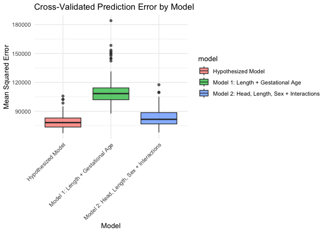

hw6_wz2722
================
wentao zhou
2024-12-02

Problem 2. Part 1.Data Cleaning

``` r
library(dplyr)
```

    ## 
    ## Attaching package: 'dplyr'

    ## The following objects are masked from 'package:stats':
    ## 
    ##     filter, lag

    ## The following objects are masked from 'package:base':
    ## 
    ##     intersect, setdiff, setequal, union

``` r
library(readr)

homicides <- read_csv("homicide-data 2.csv")
```

    ## Rows: 52179 Columns: 12

    ## ── Column specification ────────────────────────────────────────────────────────
    ## Delimiter: ","
    ## chr (9): uid, victim_last, victim_first, victim_race, victim_age, victim_sex...
    ## dbl (3): reported_date, lat, lon
    ## 
    ## ℹ Use `spec()` to retrieve the full column specification for this data.
    ## ℹ Specify the column types or set `show_col_types = FALSE` to quiet this message.

``` r
homicides <- homicides %>%
  mutate(city_state = paste(city, state, sep = ", ")) %>%
  mutate(solved_binary = ifelse(disposition == "Closed by arrest", 1, 0)) %>%
  filter(
    !city_state %in% c("Dallas, TX", "Phoenix, AZ", "Kansas City, MO", "Tulsa, AL"),
    victim_race %in% c("White", "Black")
  ) %>%
  mutate(
    victim_age = suppressWarnings(as.numeric(victim_age)) # Convert to numeric, suppress warnings
  )

# Check problematic rows where victim_age is NA after conversion
problematic_rows <- homicides %>% filter(is.na(victim_age))
print(problematic_rows)
```

    ## # A tibble: 290 × 14
    ##    uid        reported_date victim_last victim_first victim_race victim_age
    ##    <chr>              <dbl> <chr>       <chr>        <chr>            <dbl>
    ##  1 Alb-000012      20100218 LUJAN       KEVIN        White               NA
    ##  2 Alb-000122      20121026 MACAIO      WESTFALL     White               NA
    ##  3 Alb-000253      20160309 MOUZON      AALIYAH      White               NA
    ##  4 Alb-000286      20160810 SANCHEZ     IRVIN        White               NA
    ##  5 Atl-000895      20081208 JONES       DAVID        Black               NA
    ##  6 Atl-000993      20090130 DAVENPORT   LEITHA       Black               NA
    ##  7 Atl-001228      20111030 GRIER       WILLIE       Black               NA
    ##  8 Atl-001356      20130508 BENTON      WAVA         Black               NA
    ##  9 Atl-001586      20151027 Unknown     Unknown      Black               NA
    ## 10 Bat-000301      20160621 JAMES       WILLIE       Black               NA
    ## # ℹ 280 more rows
    ## # ℹ 8 more variables: victim_sex <chr>, city <chr>, state <chr>, lat <dbl>,
    ## #   lon <dbl>, disposition <chr>, city_state <chr>, solved_binary <dbl>

Part 2. Logistic Regression

``` r
library(tidyr)

#1.Logistic Regression for Baltimore, MD
 baltimore_data <- homicides %>%
   filter(city_state == "Baltimore, MD")
 library(broom)
 
 baltimore_glm <- glm(solved_binary ~ victim_age + victim_sex + victim_race,
                      data = baltimore_data, family = binomial)
 
 # Summarize results
 baltimore_results <- tidy(baltimore_glm, conf.int = TRUE, exponentiate = TRUE)
 or_male_vs_female <- baltimore_results %>%
   filter(term == "victim_sexMale") %>%
   select(estimate, conf.low, conf.high)
 
 #2.Logistic Regression for All Cities
 library(purrr)
 
 city_models <- homicides %>%
   group_by(city_state) %>%
   nest() %>%
   mutate(
     model = map(data, ~ glm(solved_binary ~ victim_age + victim_sex + victim_race,
                             data = ., family = binomial)),
     tidy_model = map(model, ~ tidy(., conf.int = TRUE, exponentiate = TRUE))
 )
```

    ## Warning: There were 45 warnings in `mutate()`.
    ## The first warning was:
    ## ℹ In argument: `tidy_model = map(model, ~tidy(., conf.int = TRUE, exponentiate
    ##   = TRUE))`.
    ## ℹ In group 1: `city_state = "Albuquerque, NM"`.
    ## Caused by warning:
    ## ! glm.fit: fitted probabilities numerically 0 or 1 occurred
    ## ℹ Run `dplyr::last_dplyr_warnings()` to see the 44 remaining warnings.

``` r
 or_results <- city_models %>%
   mutate(or_male_vs_female = map(tidy_model, ~ filter(., term == "victim_sexMale"))) %>%
   select(city_state, or_male_vs_female) %>%
   unnest(cols = or_male_vs_female) %>%
  select(city_state, estimate, conf.low, conf.high)
 print(or_results)
```

    ## # A tibble: 47 × 4
    ## # Groups:   city_state [47]
    ##    city_state      estimate conf.low conf.high
    ##    <chr>              <dbl>    <dbl>     <dbl>
    ##  1 Albuquerque, NM    1.77     0.825     3.76 
    ##  2 Atlanta, GA        1.00     0.680     1.46 
    ##  3 Baltimore, MD      0.426    0.324     0.558
    ##  4 Baton Rouge, LA    0.381    0.204     0.684
    ##  5 Birmingham, AL     0.870    0.571     1.31 
    ##  6 Boston, MA         0.674    0.353     1.28 
    ##  7 Buffalo, NY        0.521    0.288     0.936
    ##  8 Charlotte, NC      0.884    0.551     1.39 
    ##  9 Chicago, IL        0.410    0.336     0.501
    ## 10 Cincinnati, OH     0.400    0.231     0.667
    ## # ℹ 37 more rows

Part 3.Plot the Estimated ORs and CIs

``` r
or_results <- or_results %>%
  arrange(estimate) %>%
  mutate(city_state = factor(city_state, levels = city_state))
library(ggplot2)

ggplot(or_results, aes(x = city_state, y = estimate, ymin = conf.low, ymax = conf.high)) +
  geom_pointrange() +
  coord_flip() +
  labs(title = "Adjusted Odds Ratios for Solving Homicides by City",
       x = "City",
       y = "Adjusted Odds Ratio (Male vs Female)") +
  theme_minimal()
```

<!-- -->
Visual Trends:

Cities with higher OR indicate that homicide cases involving male
victims are more likely to be solved than those involving female
victims.

Cities with OR values close to 1 indicate that there is no significant
difference between male and female victims in solving murder cases.
Confidence interval:

A wider confidence interval indicates greater uncertainty in the
estimation, usually due to a smaller sample size. If the CI exceeds 1,
the impact is not statistically significant.

------------------------------------------------------------------------

Problem 3.

Part 1.Load and Clean the Data

``` r
library(tidyverse)
```

    ## ── Attaching core tidyverse packages ──────────────────────── tidyverse 2.0.0 ──
    ## ✔ forcats   1.0.0     ✔ stringr   1.5.1
    ## ✔ lubridate 1.9.3     ✔ tibble    3.2.1
    ## ── Conflicts ────────────────────────────────────────── tidyverse_conflicts() ──
    ## ✖ dplyr::filter() masks stats::filter()
    ## ✖ dplyr::lag()    masks stats::lag()
    ## ℹ Use the conflicted package (<http://conflicted.r-lib.org/>) to force all conflicts to become errors

``` r
birthweight <- read_csv("birthweight.csv")
```

    ## Rows: 4342 Columns: 20
    ## ── Column specification ────────────────────────────────────────────────────────
    ## Delimiter: ","
    ## dbl (20): babysex, bhead, blength, bwt, delwt, fincome, frace, gaweeks, malf...
    ## 
    ## ℹ Use `spec()` to retrieve the full column specification for this data.
    ## ℹ Specify the column types or set `show_col_types = FALSE` to quiet this message.

``` r
# Inspect the data
str(birthweight)
```

    ## spc_tbl_ [4,342 × 20] (S3: spec_tbl_df/tbl_df/tbl/data.frame)
    ##  $ babysex : num [1:4342] 2 1 2 1 2 1 2 2 1 1 ...
    ##  $ bhead   : num [1:4342] 34 34 36 34 34 33 33 33 36 33 ...
    ##  $ blength : num [1:4342] 51 48 50 52 52 52 46 49 52 50 ...
    ##  $ bwt     : num [1:4342] 3629 3062 3345 3062 3374 ...
    ##  $ delwt   : num [1:4342] 177 156 148 157 156 129 126 140 146 169 ...
    ##  $ fincome : num [1:4342] 35 65 85 55 5 55 96 5 85 75 ...
    ##  $ frace   : num [1:4342] 1 2 1 1 1 1 2 1 1 2 ...
    ##  $ gaweeks : num [1:4342] 39.9 25.9 39.9 40 41.6 ...
    ##  $ malform : num [1:4342] 0 0 0 0 0 0 0 0 0 0 ...
    ##  $ menarche: num [1:4342] 13 14 12 14 13 12 14 12 11 12 ...
    ##  $ mheight : num [1:4342] 63 65 64 64 66 66 72 62 61 64 ...
    ##  $ momage  : num [1:4342] 36 25 29 18 20 23 29 19 13 19 ...
    ##  $ mrace   : num [1:4342] 1 2 1 1 1 1 2 1 1 2 ...
    ##  $ parity  : num [1:4342] 3 0 0 0 0 0 0 0 0 0 ...
    ##  $ pnumlbw : num [1:4342] 0 0 0 0 0 0 0 0 0 0 ...
    ##  $ pnumsga : num [1:4342] 0 0 0 0 0 0 0 0 0 0 ...
    ##  $ ppbmi   : num [1:4342] 26.3 21.3 23.6 21.8 21 ...
    ##  $ ppwt    : num [1:4342] 148 128 137 127 130 115 105 119 105 145 ...
    ##  $ smoken  : num [1:4342] 0 0 1 10 1 0 0 0 0 4 ...
    ##  $ wtgain  : num [1:4342] 29 28 11 30 26 14 21 21 41 24 ...
    ##  - attr(*, "spec")=
    ##   .. cols(
    ##   ..   babysex = col_double(),
    ##   ..   bhead = col_double(),
    ##   ..   blength = col_double(),
    ##   ..   bwt = col_double(),
    ##   ..   delwt = col_double(),
    ##   ..   fincome = col_double(),
    ##   ..   frace = col_double(),
    ##   ..   gaweeks = col_double(),
    ##   ..   malform = col_double(),
    ##   ..   menarche = col_double(),
    ##   ..   mheight = col_double(),
    ##   ..   momage = col_double(),
    ##   ..   mrace = col_double(),
    ##   ..   parity = col_double(),
    ##   ..   pnumlbw = col_double(),
    ##   ..   pnumsga = col_double(),
    ##   ..   ppbmi = col_double(),
    ##   ..   ppwt = col_double(),
    ##   ..   smoken = col_double(),
    ##   ..   wtgain = col_double()
    ##   .. )
    ##  - attr(*, "problems")=<externalptr>

``` r
summary(birthweight)
```

    ##     babysex          bhead          blength           bwt           delwt      
    ##  Min.   :1.000   Min.   :21.00   Min.   :20.00   Min.   : 595   Min.   : 86.0  
    ##  1st Qu.:1.000   1st Qu.:33.00   1st Qu.:48.00   1st Qu.:2807   1st Qu.:131.0  
    ##  Median :1.000   Median :34.00   Median :50.00   Median :3132   Median :143.0  
    ##  Mean   :1.486   Mean   :33.65   Mean   :49.75   Mean   :3114   Mean   :145.6  
    ##  3rd Qu.:2.000   3rd Qu.:35.00   3rd Qu.:51.00   3rd Qu.:3459   3rd Qu.:157.0  
    ##  Max.   :2.000   Max.   :41.00   Max.   :63.00   Max.   :4791   Max.   :334.0  
    ##     fincome          frace          gaweeks         malform        
    ##  Min.   : 0.00   Min.   :1.000   Min.   :17.70   Min.   :0.000000  
    ##  1st Qu.:25.00   1st Qu.:1.000   1st Qu.:38.30   1st Qu.:0.000000  
    ##  Median :35.00   Median :2.000   Median :39.90   Median :0.000000  
    ##  Mean   :44.11   Mean   :1.655   Mean   :39.43   Mean   :0.003455  
    ##  3rd Qu.:65.00   3rd Qu.:2.000   3rd Qu.:41.10   3rd Qu.:0.000000  
    ##  Max.   :96.00   Max.   :8.000   Max.   :51.30   Max.   :1.000000  
    ##     menarche        mheight          momage         mrace      
    ##  Min.   : 0.00   Min.   :48.00   Min.   :12.0   Min.   :1.000  
    ##  1st Qu.:12.00   1st Qu.:62.00   1st Qu.:18.0   1st Qu.:1.000  
    ##  Median :12.00   Median :63.00   Median :20.0   Median :2.000  
    ##  Mean   :12.51   Mean   :63.49   Mean   :20.3   Mean   :1.627  
    ##  3rd Qu.:13.00   3rd Qu.:65.00   3rd Qu.:22.0   3rd Qu.:2.000  
    ##  Max.   :19.00   Max.   :77.00   Max.   :44.0   Max.   :4.000  
    ##      parity            pnumlbw     pnumsga      ppbmi            ppwt      
    ##  Min.   :0.000000   Min.   :0   Min.   :0   Min.   :13.07   Min.   : 70.0  
    ##  1st Qu.:0.000000   1st Qu.:0   1st Qu.:0   1st Qu.:19.53   1st Qu.:110.0  
    ##  Median :0.000000   Median :0   Median :0   Median :21.03   Median :120.0  
    ##  Mean   :0.002303   Mean   :0   Mean   :0   Mean   :21.57   Mean   :123.5  
    ##  3rd Qu.:0.000000   3rd Qu.:0   3rd Qu.:0   3rd Qu.:22.91   3rd Qu.:134.0  
    ##  Max.   :6.000000   Max.   :0   Max.   :0   Max.   :46.10   Max.   :287.0  
    ##      smoken           wtgain      
    ##  Min.   : 0.000   Min.   :-46.00  
    ##  1st Qu.: 0.000   1st Qu.: 15.00  
    ##  Median : 0.000   Median : 22.00  
    ##  Mean   : 4.145   Mean   : 22.08  
    ##  3rd Qu.: 5.000   3rd Qu.: 28.00  
    ##  Max.   :60.000   Max.   : 89.00

``` r
birthweight <- birthweight %>%
  mutate(
    babysex = factor(babysex, levels = c(1, 2), labels = c("Male", "Female")),
    malform = factor(malform, levels = c(0, 1), labels = c("Absent", "Present")),
    frace = factor(frace),
    mrace = factor(mrace)
  )
colSums(is.na(birthweight))
```

    ##  babysex    bhead  blength      bwt    delwt  fincome    frace  gaweeks 
    ##        0        0        0        0        0        0        0        0 
    ##  malform menarche  mheight   momage    mrace   parity  pnumlbw  pnumsga 
    ##        0        0        0        0        0        0        0        0 
    ##    ppbmi     ppwt   smoken   wtgain 
    ##        0        0        0        0

``` r
birthweight <- birthweight %>%
  mutate(across(where(is.numeric), ~ ifelse(is.na(.), mean(., na.rm = TRUE), .)))
birthweight <- birthweight %>% drop_na()
```

Part 2.Regression Model for Birthweight

``` r
library(broom)
library(modelr)
```

    ## 
    ## Attaching package: 'modelr'

    ## The following object is masked from 'package:broom':
    ## 
    ##     bootstrap

``` r
# Fit the model
hypothesized_model <- lm(bwt ~ momage + ppbmi + wtgain + smoken + gaweeks + bhead + blength + babysex + gaweeks:babysex, data = birthweight)

# Summarize the model
summary(hypothesized_model)
```

    ## 
    ## Call:
    ## lm(formula = bwt ~ momage + ppbmi + wtgain + smoken + gaweeks + 
    ##     bhead + blength + babysex + gaweeks:babysex, data = birthweight)
    ## 
    ## Residuals:
    ##      Min       1Q   Median       3Q      Max 
    ## -1088.27  -187.14    -6.61   175.63  2552.42 
    ## 
    ## Coefficients:
    ##                         Estimate Std. Error t value Pr(>|t|)    
    ## (Intercept)           -6223.1648   112.0382 -55.545  < 2e-16 ***
    ## momage                    7.3228     1.1247   6.511 8.32e-11 ***
    ## ppbmi                     4.6146     1.3612   3.390 0.000705 ***
    ## wtgain                    4.0196     0.4062   9.896  < 2e-16 ***
    ## smoken                   -2.3051     0.5819  -3.961 7.57e-05 ***
    ## gaweeks                  11.7148     1.9902   5.886 4.25e-09 ***
    ## bhead                   136.2735     3.5332  38.569  < 2e-16 ***
    ## blength                  79.3172     2.0611  38.482  < 2e-16 ***
    ## babysexFemale           -46.1135   107.1599  -0.430 0.666981    
    ## gaweeks:babysexFemale     2.0272     2.7089   0.748 0.454281    
    ## ---
    ## Signif. codes:  0 '***' 0.001 '**' 0.01 '*' 0.05 '.' 0.1 ' ' 1
    ## 
    ## Residual standard error: 281.2 on 4332 degrees of freedom
    ## Multiple R-squared:  0.6991, Adjusted R-squared:  0.6985 
    ## F-statistic:  1118 on 9 and 4332 DF,  p-value: < 2.2e-16

``` r
# Add predictions and residuals
birthweight <- birthweight %>%
  add_predictions(hypothesized_model, var = "fitted") %>%
  add_residuals(hypothesized_model, var = "residuals")

# Plot
ggplot(birthweight, aes(x = fitted, y = residuals)) +
  geom_point(alpha = 0.5) +
  geom_hline(yintercept = 0, linetype = "dashed", color = "red") +
  labs(title = "Residuals vs Fitted Values", x = "Fitted Values", y = "Residuals") +
  theme_minimal()
```

<!-- -->

Part 3. Compare the Hypothesized Model to Two Others Model 1: Length and
Gestational Age Model 2: Head Circumference, Length, Sex, and
Interactions

``` r
library(tidyverse)
library(rsample)
library(purrr)

# Define models 
model1 <- lm(bwt ~ blength + gaweeks, data = birthweight)
model2 <- lm(bwt ~ bhead * blength * babysex, data = birthweight)

# Create Monte Carlo cross-validation splits
set.seed(123)
cv_splits <- vfold_cv(birthweight, v = 10, repeats = 10)  # 10-fold CV with 10 repeats

# Define a function to calculate Mean Squared Error (MSE)
calc_mse <- function(model, data) {
  preds <- predict(model, newdata = data)
  mean((data$bwt - preds)^2, na.rm = TRUE)
}

# Cross-Validation for Each Model
cv_results <- cv_splits %>%
  mutate(
    hypothesized_mse = map_dbl(splits, ~ {
      train_data <- analysis(.x)  # Extract training data
      test_data <- assessment(.x)  # Extract testing data
      model <- lm(bwt ~ momage + ppbmi + wtgain + smoken + gaweeks + 
                    bhead + blength + babysex + gaweeks:babysex, data = train_data)
      calc_mse(model, test_data)
    }),
    model1_mse = map_dbl(splits, ~ {
      train_data <- analysis(.x)
      test_data <- assessment(.x)
      model <- lm(bwt ~ blength + gaweeks, data = train_data)
      calc_mse(model, test_data)
    }),
    model2_mse = map_dbl(splits, ~ {
      train_data <- analysis(.x)
      test_data <- assessment(.x)
      model <- lm(bwt ~ bhead * blength * babysex, data = train_data)
      calc_mse(model, test_data)
    })
  )

# Summarize MSE for each model
mse_summary <- cv_results %>%
  summarize(
    hypothesized = mean(hypothesized_mse, na.rm = TRUE),
    model1 = mean(model1_mse, na.rm = TRUE),
    model2 = mean(model2_mse, na.rm = TRUE)
  )

print(mse_summary)
```

    ## # A tibble: 1 × 3
    ##   hypothesized  model1 model2
    ##          <dbl>   <dbl>  <dbl>
    ## 1       79592. 111479. 83699.

``` r
# Visualize MSE Distributions
cv_long <- cv_results %>%
  pivot_longer(cols = ends_with("_mse"), names_to = "model", values_to = "mse") %>%
  mutate(model = recode(model,
                        "hypothesized_mse" = "Hypothesized Model",
                        "model1_mse" = "Model 1: Length + Gestational Age",
                        "model2_mse" = "Model 2: Head, Length, Sex + Interactions"))

ggplot(cv_long, aes(x = model, y = mse, fill = model)) +
  geom_boxplot(alpha = 0.7) +
  labs(title = "Cross-Validated Prediction Error by Model",
       x = "Model",
       y = "Mean Squared Error") +
  theme_minimal() +
  theme(axis.text.x = element_text(angle = 45, hjust = 1))
```

<!-- -->

Interpretation 1.Model Fit: Compare the adjusted R^2 and significant
predictors for each model. Evaluate residual plots for patterns or
heteroscedasticity.

2.Cross-Validation: The model with the lowest average MSE across folds
has better predictive performance.

3.Tradeoffs: Simpler models (e.g., Model 1) may generalize better but
miss important relationships.

Complex models (e.g., Model 2) might overfit, particularly with
interaction terms.
